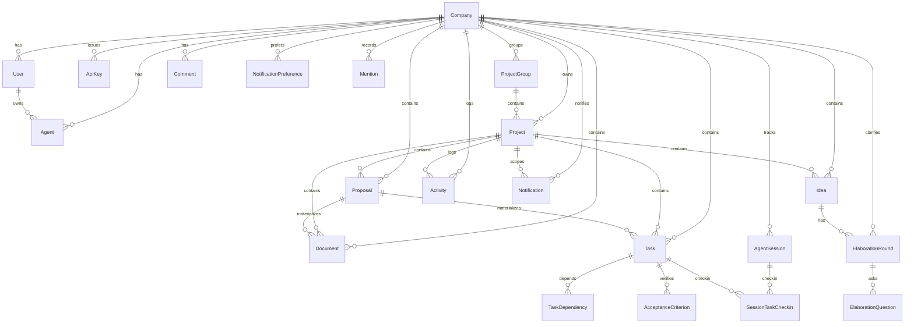

# 数据模型精读（Prisma / ER Diagram）

> 源码：`prisma/schema.prisma`  
> 目标：你能从“实体关系”理解 Chorus 的流程与可观测性为什么这样设计。

## 1) ER 图（概念级）

> 说明：Chorus 在 DB 层不强制外键（`relationMode = "prisma"`），但在 Prisma/Service 层仍然按关系建模。下图按“概念关系”绘制。

## 2) 多租户隔离（CompanyUuid 是贯穿线）

几乎所有核心表都包含 `companyUuid` 字段：

- 读路径：service 层查询基本都会带 `where: { uuid, companyUuid }`
- 写路径：创建时必须写入 `companyUuid`

这让 Chorus 能在同一个 DB 里承载多个 company，同时不混淆数据。

## 3) 多态字段（Polymorphic）的两处关键设计

### 3.1 assigneeType + assigneeUuid

Idea/Task 的 assignee 可以是：

- `user`（人类）
- `agent`（AI agent）

因此使用 `(assigneeType, assigneeUuid)` 表达，而不是外键。

相关逻辑：

- `src/lib/auth.ts`：`isAssignee(...)`
- `src/services/assignment.service.ts`：把“agent 直接认领 + owner 代认领”合并查询

### 3.2 Notification recipientType + recipientUuid

通知接收者也可以是 user 或 agent，并且要尊重偏好开关（`NotificationPreference`）。

相关逻辑：

- `src/services/notification.service.ts`（create/list/preferences）
- `src/services/notification-listener.ts`（activity → notification）

## 4) Proposal 的“容器模型”与 JSON drafts

Proposal 使用 JSON 字段保存草稿：

- `documentDrafts`
- `taskDrafts`

这让“审批前多轮编辑”不需要为 draft 建大量表，同时保持灵活。代价是：

- 校验逻辑必须在 service 层更严格（见 `validateProposal`）
- 物化时需要把 draft 的 UUID 映射为真实 Document/Task 的 UUID

相关逻辑：

- `src/services/proposal.service.ts`：`ensure*DraftUuid`、`validateProposal`、`approveProposal`

## 5) AcceptanceCriterion：结构化验收条目

为避免单段 Markdown 验收标准的并发写冲突，Chorus 引入独立表：

- `AcceptanceCriterion`（每条独立更新：dev self-check + admin verify）
- `Task.acceptanceCriteria` 作为 legacy 兼容字段（主要用于历史数据展示）

相关逻辑：

- `src/services/task.service.ts`：`computeAcceptanceStatus` 与 `acceptanceSummary`

## 6) Session/Checkin：把“执行中的上下文”建模

Chorus 用两张表表达“哪个 session 正在处理哪个 task”：

- `AgentSession`（session 自身，含 lastActiveAt）
- `SessionTaskCheckin`（session 与 task 的关联，含 checkinAt/checkoutAt）

相关逻辑：

- `src/services/session.service.ts`
- MCP 工具：`src/mcp/tools/session.ts`

