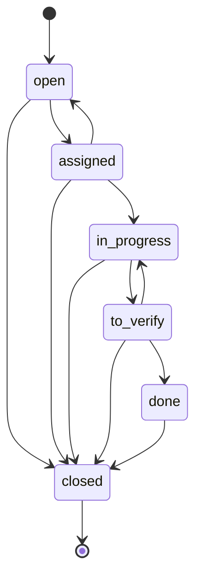
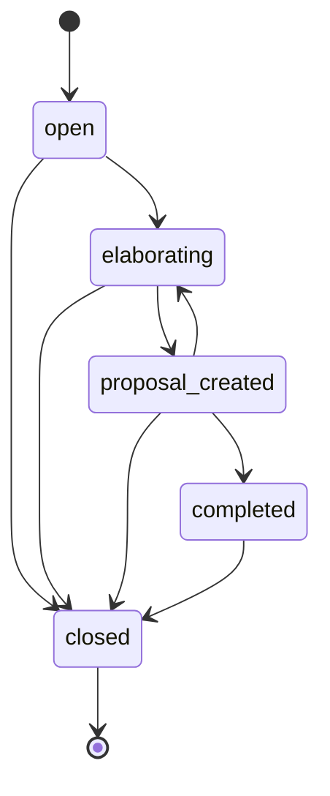
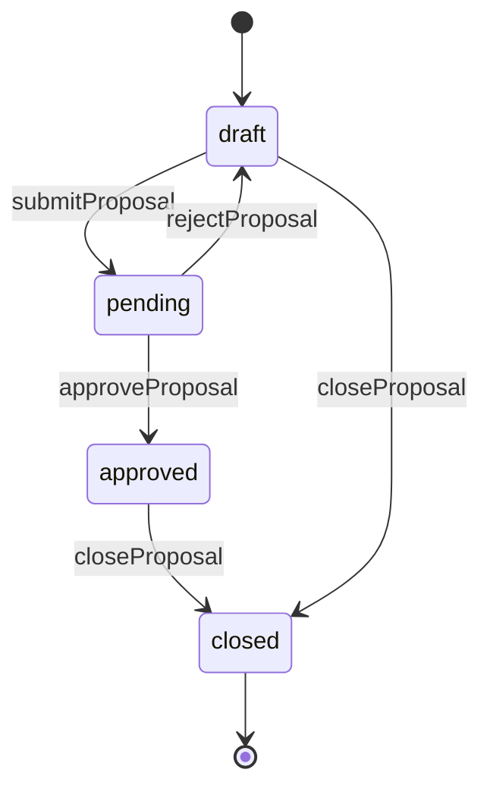
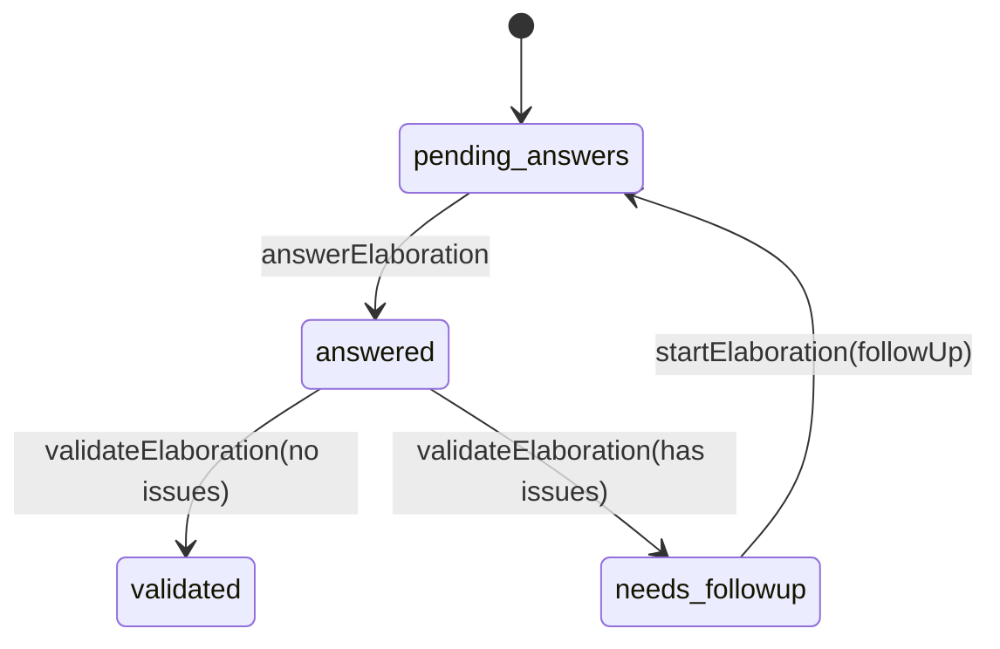
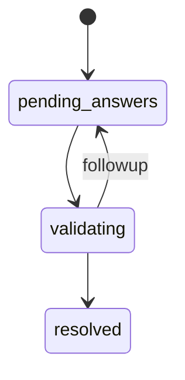

# 状态机（Idea / Task / Proposal / Elaboration）

Chorus 的看板并不是“仅 UI 展示”，而是由服务层显式定义与校验的状态机。理解状态机，是理解整个系统约束与失败模式的关键。

## 1) Task 状态机

源码入口：`src/services/task.service.ts`（`TASK_STATUS_TRANSITIONS`）

关键约束（学习版总结）：

- todo 列常见映射：`open + assigned`
- done 列常见映射：`done + closed`
- `to_verify → in_progress` 代表“验证不通过/需要返工”

## 2) Idea 状态机（AI-DLC 简化生命周期）

源码入口：`src/services/idea.service.ts`（`IDEA_STATUS_TRANSITIONS`）

注意：

- 代码里存在历史状态归一化（`normalizeIdeaStatus`），老数据可能出现 `assigned/in_progress/pending_review` 等。

## 3) Proposal 状态机（容器：草稿 → 审批 → 物化）

源码入口：`src/services/proposal.service.ts`

关键约束：

- 只有 `draft` 能提交 review（`submitProposal` 会先跑 `validateProposal`）
- “驳回”在实现上是回到 `draft`，但会保留 `reviewedBy/reviewNote/reviewedAt` 作为修订参考
- 审批通过会物化 Document/Task，并对 input Ideas 做自动状态推进（`proposal_created → completed`）

## 4) Elaboration（需求澄清）状态机

Elaboration 由两层状态组成：

1. `Idea.elaborationStatus`：全局进度（`pending_answers` / `validating` / `resolved`）
2. `ElaborationRound.status`：每一轮问答的状态（`pending_answers` / `answered` / `validated` / `needs_followup`）

源码入口：`src/services/elaboration.service.ts`

### 4.1 Round 状态机

### 4.2 Idea.elaborationStatus（概念图）

