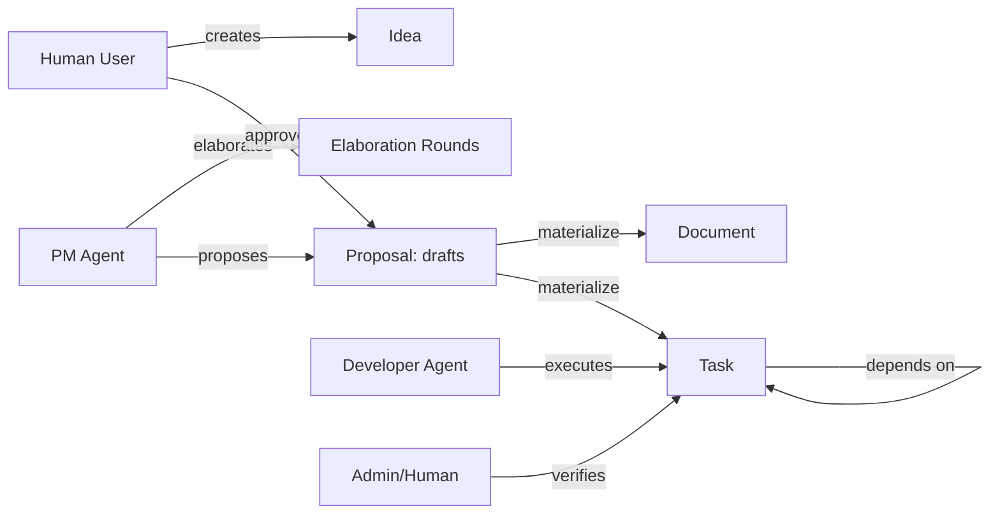

# 系统总览（学习版 Architecture）

> 对照阅读：`docs/ARCHITECTURE.md`（更完整）  
> 这份是“学习版”，核心目标是：你能用目录结构把架构图对上号。

## 1) Chorus 的核心对象

Chorus 的“业务骨架”可以用一张图概括：

要点：

- **Idea** 是输入，**Proposal** 是“计划容器”，审批后物化为 **Document/Task**。
- **Task** 支持 DAG 依赖与结构化验收条目。
- **Session/Checkin** 让“执行中”可被看见（多 Agent 并行不再黑盒）。

## 2) 分层与目录对应关系

Chorus 的代码组织非常“按层切”：

- UI + App Router：`src/app/(dashboard)/**`、`src/components/**`
- HTTP API：`src/app/api/**/route.ts`
- MCP Endpoint：`src/app/api/mcp/route.ts`
- MCP tools：`src/mcp/tools/*.ts`
- 业务服务层（真相源）：`src/services/*.service.ts`
- 基础设施与通用库：`src/lib/**`
- 数据模型：`prisma/schema.prisma`

你在追一条业务链路时，最常见的路径是：

`page.tsx / route.ts / server action` → `service.ts` → `prisma` → `eventBus` → `SSE` → `router.refresh`

## 3) 三类参与者与它们的“接口”

- Human：主要通过 Web UI + REST API（cookie/OIDC）
- Agent：主要通过 MCP tools（API Key + role-based toolset）
- Admin：既可能是 UI，也可能是 Admin Agent（高权限工具）

MCP 装配逻辑：

- `src/mcp/server.ts` 根据 `auth.roles` 注册 Public/Session/PM/Developer/Admin 工具集。

## 4) “可观测性”是硬需求，不是附加功能

Chorus 把这些变成一等数据模型：

- Session：`AgentSession`
- Checkin：`SessionTaskCheckin`
- Activity：`Activity`（带 session attribution）
- Notification：`Notification` + 偏好

建议你下一步阅读：

- 数据模型：[`data-model.md`](./data-model.md)
- 状态机：[`state-machines.md`](./state-machines.md)
- Realtime：[`realtime-events.md`](./realtime-events.md)

