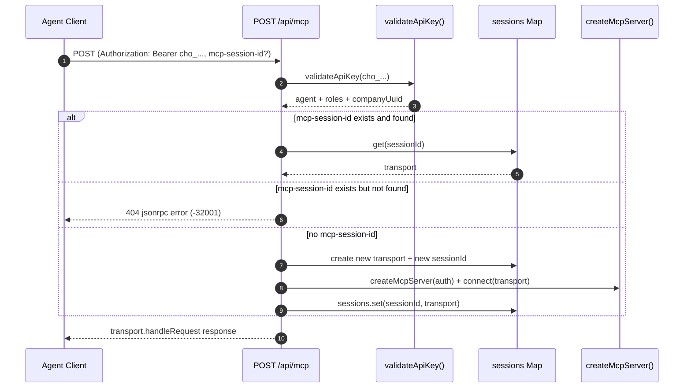
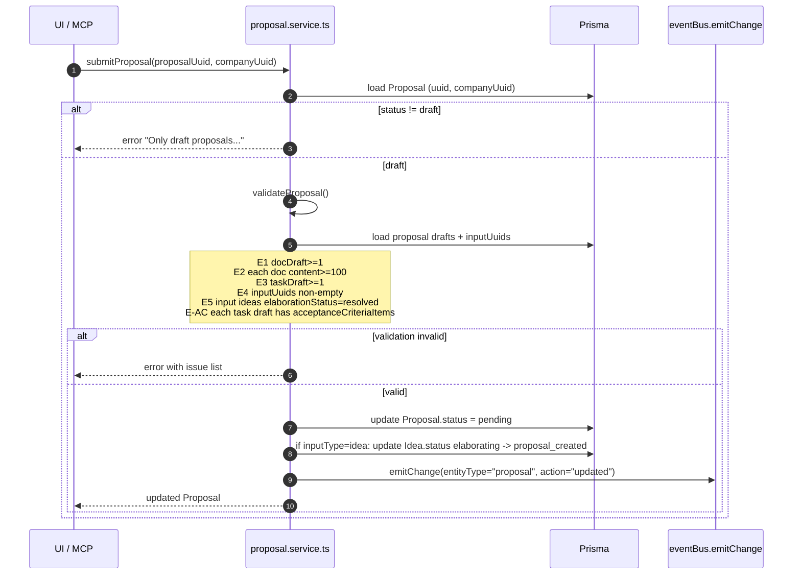
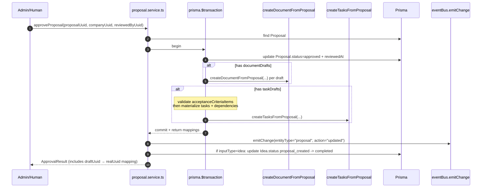
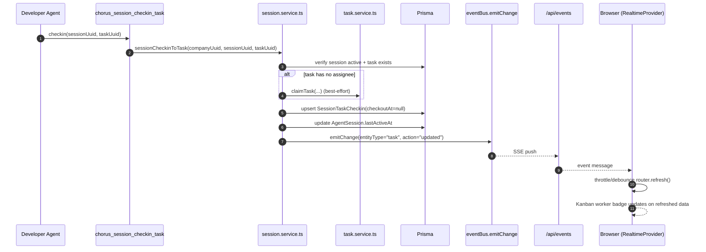
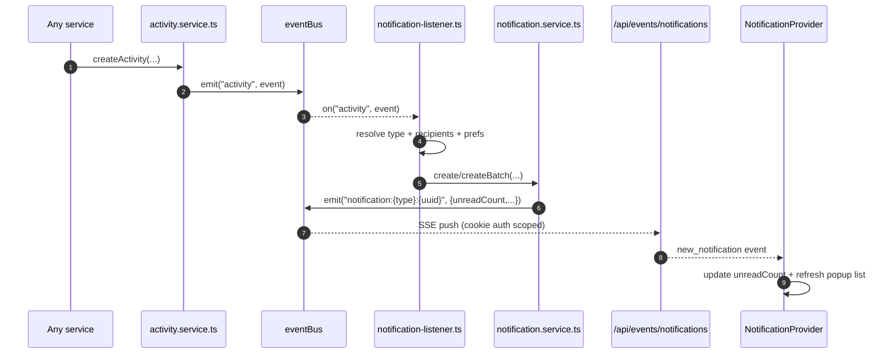

# 核心链路精读（End-to-End）

这份文档把 Chorus 最重要的几条链路用“可执行的追踪方式”写清楚：你可以跟着每一步去点开对应文件，理解系统如何从 UI/MCP 走到 service/DB，再走回 realtime/notifications。

## Flow 0: AI-DLC 主流程（全景）

```mermaid
flowchart TD
  A[Idea: open] -->|claim| B[Idea: elaborating]
  B -->|start elaboration| C[ElaborationRound: pending_answers]
  C -->|answer| D[ElaborationRound: answered]
  D -->|validate ok| E[Idea.elaborationStatus: resolved]
  E -->|create proposal| F[Proposal: draft]
  F -->|submit| G[Proposal: pending]
  G -->|approve| H[Proposal: approved]
  H --> I[Document(s)]
  H --> J[Task(s) + DAG]
  J -->|execute| K[Task: in_progress/to_verify/done]
```

关键落点：

- 数据：`prisma/schema.prisma`
- Idea：`src/services/idea.service.ts`
- Elaboration：`src/services/elaboration.service.ts`
- Proposal：`src/services/proposal.service.ts`
- Tasks：`src/services/task.service.ts`

## Flow 1: MCP Session 建立与复用（含 404 重建）

入口：

- MCP endpoint：`src/app/api/mcp/route.ts`
- server/tool 装配：`src/mcp/server.ts`



学习点：

- sessions 是内存 Map，server 重启会丢；客户端应对 404 自动 reinit（`docs/MCP_TOOLS.md` 也有说明）。
- 工具集按 roles 装配（Public/Session/PM/Developer/Admin）。

## Flow 2: Proposal 提交（draft → pending）与完整校验

入口：

- service：`src/services/proposal.service.ts`（`submitProposal` / `validateProposal`）



你排查“为什么提交失败”时，就去看 `validateProposal` 的 issue 列表：它是最关键的“质量闸门”之一。

## Flow 3: Proposal 审批（pending → approved）并物化 Document/Task/DAG

入口：

- service：`src/services/proposal.service.ts`（`approveProposal`）



学习点：

- 物化是事务内完成，避免“proposal 状态已 approved 但 artifacts 半失败”的不一致。
- tasks 物化前会再次校验 `acceptanceCriteriaItems` 的描述有效性。

## Flow 4: Task 执行可观测性（Session checkin → UI worker badges）

入口：

- MCP 工具：`src/mcp/tools/session.ts`（`chorus_session_checkin_task`）
- service：`src/services/session.service.ts`（`sessionCheckinToTask`）
- realtime：`src/app/api/events/route.ts` + `src/contexts/realtime-context.tsx`



## Flow 5: 通知链路（Activity → Notification → SSE）

入口：

- activity：`src/services/activity.service.ts`
- listener：`src/services/notification-listener.ts`
- notification service：`src/services/notification.service.ts`
- SSE：`src/app/api/events/notifications/route.ts`



补充：

- @mention 通知是另一条路径：`mention.service.ts` 直接调用 `notificationService.createBatch`（不一定经过 activity）。

